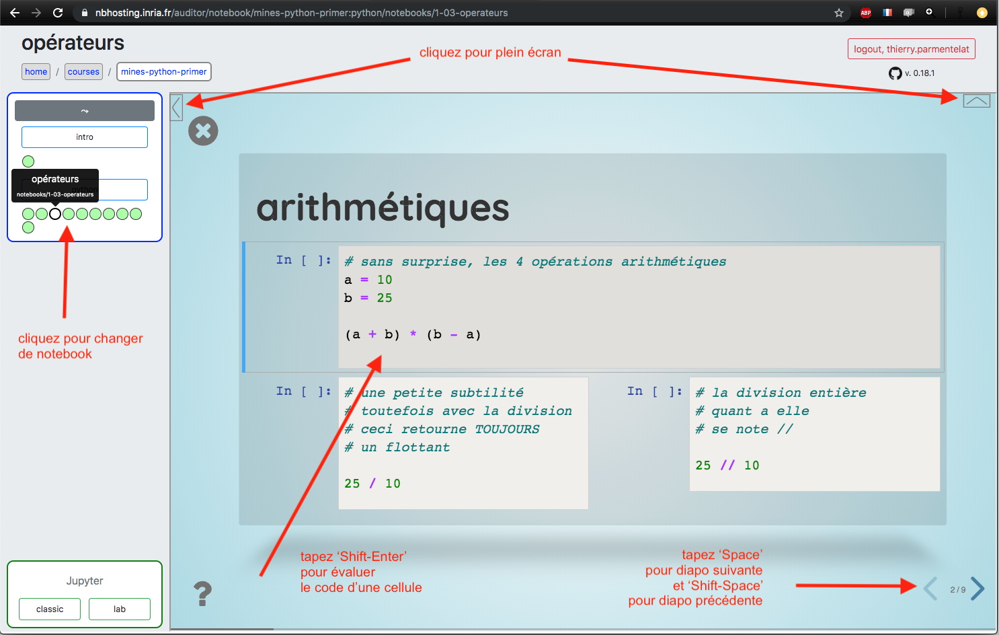

Sommaire
=================

   * [les contenus du cours](#les-contenus-du-cours)
      * [notebooks](#notebooks)
      * [support de cours au format html](#support-de-cours-au-format-html)
      * [les sources des cours](#les-sources-des-cours)
   * [utilisation des notebooks](#utilisation-des-notebooks)
      * [nbhosting](#nbhosting)
      * [installation locale](#installation-locale)
         * [prérequis](#prérequis)
         * [télécharger le cours](#télécharger-le-cours)
         * [installations additionnelles](#installations-additionnelles)
         * [lancement](#lancement)
      * [visionneuse de slides](#visionneuse-de-slides)
   * [mise à jour du cours](#mise-à-jour-du-cours)
      * [nbhosting](#nbhosting-1)
      * [installation locale](#installation-locale-1)
   * [divers](#divers)
      * [format html <em>offline</em>](#format-html-offline)

# les contenus du cours

## notebooks

Le cours est exclusivement écrit sous forme de notebooks Jupyter.  
Ainsi le professeur peut **exécuter le code** dans les slides
au fur et à mesure des explications.  

Les étudiants peuvent expérimenter de la même façon de leur coté, 
en modifiant le code si nécessaire. Pour cela deux options sont disponibles :

* plateforme hébergée *nbhosting*  
  tous les étudiants ont un compte sur `nbhosting.inria.fr`; à partir de là vous avez
  accès aux cours interactifs dans votre navigateur **sans aucune installation**
  sur votre ordinateur. C'est la méthode préconisée pour les tous premiers cours, 
  pour ne pas dépendre des aléas d'une installation locale.

* installation locale  
  toutefois, dans l'esprit de la prise d'autonomie, à terme les étudiants devront être
  capables d'installer localement sur leur ordinateur personnel la pile git et Jupyter
  nécessaire pour pouvoir jouer les cours localement

Nous donnons plus loin les modalités de mise en oeuvre et d'utilisation de ces deux
options.

## support de cours au format html

Le contenu des cours est également disponible au format `html`. Par exemple le cours 
dit 'Python primer' d'introduction à Python - numpy - pandas est disponible sur
https://flotpython-primer.readthedocs.io. Il s'agit d'un contenu statique et non 
interactif; le code a été exécuté lors de la génération, il n'est ni modifiable 
ni exécutable.  

Ce format peut s'avérer utile pour les révisions, il contient une table des matières, et
il est possible de rechercher un terme.

Notez également la présence de notes qui approfondissent les slides; ces notes
n'apparaissent pas à l'écran lorsque les notebooks sont projetés sous forme de
diapositives, mais elles apparaissent dans la sortie html.

## les sources des cours

Les contenus, les notebooks donc, sont accessibles sous forme d'un dépôt git. Pas
de panique si vous ne connaissez pas, c'est l'objet d'un des tous premiers cours. 

L'idée est de permettre à tous de télécharger la dernière version, et de rester à jour
lors de mises à jour. Notamment, les contenus peuvent être diffusés au fur et à mesure -
par exemple une semaine à la fois - il faut alors se mettre à jour au fur et à mesure.


# utilisation des notebooks


## nbhosting

Seuls les cours dont le nom commence par `mines-` sont à destination de l'École des Mines, veuillez ignorer les autres cours.

**Attention** il faut s'attendre à un délai assez long la première fois qu'on se connecte
sur un cours, ou après une période d'inactivité, le temps de réallouer les ressources pour
la session.



## installation locale

### prérequis

Il vous faut avoir installé au préalable Python et git.

Pour ceux qui installent ces outils pour la première fois, on recommande :

* en ce qui concerne Python, la distribution *anaconda* <https://www.anaconda.com/distribution>
* en ce qui concerne git :
  * sur Windows, <https://gitforwindows.org> qui vient avec un terminal compatible *bash*
  * sur MacOS, peu importe en fait la méthode utilisée
  * sur Linux, utilisez le package manager (dnf, apt-get)

* en option, sur Windows et MacOS, l'installation de SourceTree
  <https://www.sourcetreeapp.com/>, comme interface graphique pour git, peut s'avérer
  pratique.

### télécharger le cours

Il vous faut bien sûr télécharger le cours; pour cela tapez dans un terminal

```bash
git clone https://github.com/flotpython/primer 

# ce qui va créer un répertoire 'primer'
# dans lequel on va aller pour la suite
cd primer
```

### installations additionnelles

Pour ajouter les composants additionnels dont le cours a besoin en plus de Python et git, 
tapez dans un terminal (dans le même répertoire `primer` créé ci-dessus)

```bash
pip install -r requirements.txt
```


### lancement

Toujours dans le répertoire `primer`, vous lancez les notebooks en tapant

```bash
jupyter notebook
```
Ouvrez le répertoire `notebooks`, cliquez sur un notebook,
ce sont les fichiers dont le nom est en `.ipynb` (pour IPython notebook).

## visionneuse de slides

Quel que soit le mode hébergé ou local, les notebooks comportant des slides démarrent en
principe automatiquement en mode slide; pour aller/revenir vers le mode notebook
*classic* :

* avec le clavier, utiliser 'Alt-r'  (Option-r sur MacOS)
* avec la souris
  * pour quitter le mode slide, la grosse croix en haut à gauche
  * pour entrer dans le mode slide, l'icône en forme de barchart 


Les touches cruciales :

* *`Espace`* ou *`Shift-Espace`* pour se déplacer dans les slides
* *`Shift-Enter`* pour évaluer la cellule courante
* *`Control +`* et *`Control -`* pour agrandir / rapetisser le contenu; utile pour s'adapter au contenu lorsqu'un slide est plus dense; ce sont ici les raccourcis standard du navigateur, sur MacOS faire plutôt *`Command +`* et *`Command -`*

Et aussi :

* si vous entrez par mégarde en mode édition, comme d'habitude utiliser `Escape` pour revenir en mode commande; sinon vous ne commandez plus la visionneuse, vous insérez dans la cellule courante, évidemment..
* la touche `w` permet d'accéder au mode 'overview'; utilisez les flêches pour vous déplacer dans la présentation, et tapez à nouveau `w` pour revenir au mode slide usuel


* la touche `t` permet de passer en mode 'orateur' avec deux vues distinctes, l'une pour le public et l'autre pour l'orateur; cela suppose de placer les deux vues sur des displays différents; pour en sortir fermez simplement la fenêtre de notes. C'est un setup qui peut s'avérer compliqué à mettre en place en cours. L'avantage est de voir la slide suivante.


# mise à jour du cours

Les semaines suivantes, vous pouvez être amenés à mettre à jour votre dépôt git, 
typiquement pour aller chercher du nouveau contenu.

Ceci s'applique pour les deux options (nbhosting et local); 
en effet en interne `nbhosting` crée lui aussi un dépôt git pour chaque étudiant.


## nbhosting

Pour cela actuellement il est nécessaire de passer par jupyterlab (en bas à gauche dans la
vue nbhosting, sortie du mode plein écran). Deux options :

* jupyterlab est buildé avec l'extension `jupyterlab-git` qui permet de tirer, voir les
  changements, les abandonner si nécessaire..

  

* en ligne de commande, pour cela créer un terminal sous jupyter et aller dans `work`

  ]


## installation locale

Pour mettre à jour votre copie locale du cours, il vous suffit de faire dans un terminal :

```bash

# retournez dans le répertoire qui contient le cours
cd primer

# pour tirer les nouveautés
git pull
```


# divers

## format html *offline*

Si vous voulez lire les supports de cours 'hors ligne', téléchargez une version statique, 
par exemple toujours pour le cours 'Python primer':

https://readthedocs.org/projects/flotpython-primer/downloads/htmlzip/latest/
